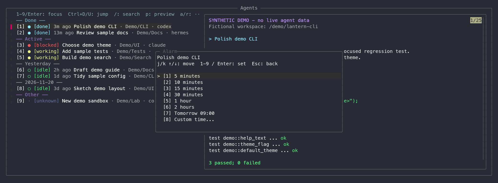

# Herdr Agent Picker

**[Download v0.2.0](https://github.com/kungbi/herdr-agent-picker/releases/tag/v0.2.0)** · Native Rust plugin for macOS and Linux.

A compact, keyboard-driven agent popup for Herdr.


*Terminal preview: `j`/`k` to move, `/` to search, `p` to toggle preview, Enter to focus.*



*Alarm presets: `a` to open, `j`/`k` or arrows to move, `1`–`8` or Enter to choose, Esc to cancel.*

Both screenshots capture the release Rust binary and real fzf in an isolated PTY,
rendered from ANSI with a monospace font. All agents, tasks, paths and preview
output are synthetic; no live Herdr sessions or notifications were used.

- Colored status first, bold task title, dim workspace/tab location.
- The preview starts at the bottom and follows new output. `Shift+U` / `Shift+D` move up / down half a screen; `Shift+K` / `Shift+J` move up / down two rendered rows. Scrolling up freezes the displayed history without changing the selected agent. Returning to the bottom with `Shift+J`, Shift+Down, or `Shift+D` resumes live follow; `End` also resumes it. Plain `u` and `d` do not scroll.
- `j`/`k` or arrow keys to navigate; `Ctrl+D`/`Ctrl+U` to move five agents at a time.
  Enter to focus; Esc or `q` to close in normal mode.
- Press `/` to search by task, workspace, tab, or agent name. Use arrow keys to
  navigate results and Enter to focus. Esc clears the search and returns to normal
  navigation without closing the picker, even with an empty query or no matches.
  Press Esc or `q` in normal mode to close; while searching, `q` and `i` are ordinary text.
- Press `i` in normal mode to type directly into the selected agent in the right preview.
  Keys go straight to that terminal; standalone Esc returns locally.
- Preview opens automatically on the right, using 60% of the popup width.
  Codex, Hermes and other agents use the same colored terminal snapshot path:
  their own rendered output, not a second Markdown renderer or rebuilt chat.
  Press `p` outside search to hide or show it.
  Preview may contain sensitive terminal text; hide it before screen sharing.
- Press `1`–`9` to focus a numbered item immediately, without Enter.
- Current Done and Active agents come first, followed by idle completion history by date.
- Completion ages such as `3m ago`; model metadata is hidden.
- Refreshes the list and status every second while the popup is open.
- Per-agent reminders with time presets, custom dates and cancellation.

## Requirements

- Herdr 0.9.1 or newer.
- System SQLite 3 library (included in macOS; `libsqlite3-0` on Debian/Ubuntu).
- fzf 0.73.1 or newer, available on PATH.
- macOS or Linux. Tested on macOS; Windows is not supported.

On macOS with Homebrew:

```sh
brew install fzf
```

Native release packages include the Rust executable and need no Python or Rust
installation. Use a package matching your OS and architecture; CI builds packages
for its macOS and Linux runner architectures. Other macOS/Linux architectures can build from
source. Linux GNU packages require a compatible glibc (build on the oldest target
system when distributing to older Linux releases).

## Build from source

A source checkout or source archive requires a Rust toolchain and SQLite headers
(`libsqlite3-dev` and a C toolchain on Debian/Ubuntu; Xcode command line tools on
macOS). Build within the checkout:

```sh
sh ./run build
sh ./run check
```

For a cached, disconnected build use `sh ./run build --offline`. The launcher uses
`bin/herdr-agent-picker` in native packages, or `target/release/herdr-agent-picker`
in a source checkout. It does not invoke Python, install anything globally, or
compile during hooks/popup startup. Rebuild after changing Rust source.

## Native packages

Extract the matching `.tar.gz` or `.zip` package to a permanent directory and
follow Local installation below. Check it against its `SHA256SUMS-<target>` file.
Source archives include Rust code, native integration tests and the Python
packaging tool, without a prebuilt binary. `herdr plugin install` from a source
Git ref also requires the build step; automatic source compilation during
installation is not assumed.

## Local installation

Keep this directory in a permanent location. Run:

```sh
sh ./run check
herdr plugin link "$PWD" --enabled
```

Add this to your Herdr `config.toml`, replacing any existing `prefix+g` command:

```toml
[keys]
goto = ""
next_agent = ""

[[keys.command]]
key = "prefix+g"
type = "plugin_action"
command = "agent-picker.open"
description = "Select agent"
```

Merge the entries into any existing `[keys]` section instead of duplicating it.
Then run `herdr server reload-config`. Use your prefix followed by `g`.

Native packages need no compilation. Build source checkouts before linking them.

## Original terminal preview

The preview reads enough recent unwrapped lines to fill its height, with a minimum of 30 lines for scrolling.
The picker preserves the agent's rendered colors, emphasis, code, text and message
order instead of parsing Markdown again. There is no Hermes-specific database
lookup, saved-conversation header, role reconstruction, or newest-first reversal.

Right-edge frames are detected from a blank framed row and their terminal column,
counting Korean/wide and combining characters rather than string length. The
matching outer `│`/`┃` and trailing spaces are removed even with zero or short
padding; ordinary table borders and leading code indentation stay intact. ANSI
styles, original paragraph breaks and source-side hard line breaks are preserved.
The terminal you opened the picker from is previewed without resizing it. For
other agents, the picker temporarily attaches at the preview's rows and columns.
This resizes the selected terminal's PTY, not the Herdr split. The
attachment is released when selection changes, the preview is hidden, the picker
closes, or a read fails. The source application may redraw while attached and
again when released. A recent snapshot is not a pixel-identical mirror: the last
30 source rows can include input/status UI. A snapshot without a blank frame
reference, complex joined emoji widths, hard-drawn tables and source-side
truncation are not reconstructed. Literal Markdown already present in the source
is intentionally unchanged.

The visible preview refreshes every second, including when agent status is
unchanged. Hiding it stops pane reads. Attach is exclusive and never uses
`--takeover`; if another client holds the terminal, or attach/read fails, the
preview shows `Preview unavailable`. Enter still opens the original pane.
In navigation mode, previewing never sends input, changes focus, resizes splits, or acknowledges a
reminder. The baseline attachment protocol was checked with Herdr 0.9.5; this checkout
validates it with isolated PTY attachments. Glow is not used by the picker.

## Type directly in the right preview

Press `i` outside search to enter the selected agent's real terminal through the
preview's existing PTY attachment. The left list remains visible and its reloads
pause, pinning the recipient. Each typed byte goes directly to that attachment:
letters arrive before Enter, Korean UTF-8, arrows, backspace, control keys,
Enter and bracketed paste are forwarded unchanged. There is no draft, Send step,
or `agent prompt` submission. In search, `i` remains query text.

Standalone Esc returns locally to picker navigation without sending Esc. It waits
40 ms to distinguish Esc from a terminal escape sequence; the initial Esc of an
arrow/Alt sequence must be followed within that interval. Inside bracketed paste,
Esc is data. Text already delivered remains in the agent; returning does not undo
it. Enter, Ctrl+C and other forwarded keys have their normal target-terminal
meaning. Picker navigation, preview scrolling, focus and alarms resume on return.

Input reuses the preview's exclusive `terminal attach` connection at the exact
fzf preview grid, without `--takeover`. The picker keeps fzf on its own PTY so it
can continue painting while input goes to the target. Output uses the existing
Herdr snapshots (about 100 ms while interacting, one second otherwise); only
printable text, line breaks, tabs and SGR styles reach fzf. Raw attachment escapes
are drained, never replayed over the picker. This is snapshot rendering, with the
same wrapping/history limitations as the ordinary preview.

A hidden/unavailable/busy attachment, missing or unsafe foreground identity,
lookup failure, disappearing/replaced agent, terminal/session/PID change, read
failure or resize stops input visibly and requires Esc. Input is never retried or
redirected to another terminal or a shell. The current-origin and unknown-origin
previews remain read-only: Herdr 0.9.5 attach has no non-resizing option, so `i`
refuses them visibly to preserve the visible pane's size. Show an available
non-origin agent preview to interact.

Identity is rechecked while idle and before each raw delivery batch. Herdr has no
atomic identity-conditioned terminal write, so a check/write race remains; a
foreground switch between the final check and delivery cannot be eliminated.
Unfamiliar executable wrappers may be conservatively rejected. FIFO/PTY
backpressure fails closed instead of buffering a message or retrying delivery.
The tests use real fzf and an isolated PTY receiver; a disposable real Herdr server
was attempted locally but sandbox socket permissions blocked startup.

## Reminders

Select an agent and press `a` to schedule a reminder to revisit it, regardless of
whether its work has finished. A small centered dialog opens over the agent list;
Esc returns to the same selection. Custom input and the `r` reminder manager also
use compact dialogs. Choose 5, 10, 15 or 30 minutes, 1 or 2 hours,
tomorrow at 09:00, or **Custom time**.

Custom time has separate **Date** (year, month, day) and **Time** (hour, minute)
fields, prefilled to 30 minutes from now or the agent's existing reservation.

- `Tab` or `←`/`→`: select a field; brackets mark the active field.
- `↑`/`↓` or `k`/`j`: increase or decrease its value.
- Type digits to replace the selected field.
- `Enter`: save; `Esc`: cancel.

Dates and clock times use your computer's local timezone. Invalid dates and past
times show an error without changing the reservation.

Scheduled reminders appear beside their agent as `[alarm MM-DD HH:MM]`.
Unread reminders show a red `[!]` immediately after the number, so the marker
stays visible when the preview narrows the list. Opening the agent with Enter
clears the marker; closing the picker without opening it leaves the marker.

There is one reminder per agent: setting another replaces it. Press `a` again
and choose **Cancel current alarm**, or press `r` to list scheduled alarms and
select one to cancel. Escape leaves a menu without changing the reservation or
focus; Escape also closes the custom date/time form.

Reminders persist locally and run after the picker closes. At the due time,
Herdr displays a notification with its completion sound. A desktop notification
is also requested on macOS and on Linux when `notify-send` is installed. Allow
notifications in your desktop settings; the OS may suppress them in Focus mode.
The reminder never sends input to an agent or changes the focused pane.

An overdue reminder is delivered after the computer wakes. After a reboot, open
the picker to resume saved reminders. Failed deliveries are retried every minute.
Reminder data stays in `HERDR_PLUGIN_STATE_DIR/reminders.sqlite3` (or the standalone
state directory below); it is excluded from Git and release archives.

## Completion times and ordering

Herdr event hooks record when completion is observed. Tasks completed before the
plugin was enabled have no known completion time. This is not an archived task
history: the picker lists current agents and their latest observed completion.

Current Done agents come first, followed by Active. Within Active, when
`ui.agent_panel_sort = "priority"`, blocked agents precede working agents.
Done includes Herdr's `done` agents and observed working/blocked-to-idle finishes
that have not been visited since completion. Herdr can report a finish in its
last-focused pane as `idle` while the user is elsewhere. These finishes stay in
Done until focus returns to the pane, including selection in the picker, or new
work starts. Previously acknowledged idle agents remain in date history.
Done is sorted by latest known completion time; agents with no known completion
time follow in the same group.
Idle agents with a recorded completion appear below Active, grouped by local
calendar date and sorted newest first within each date. Idle agents with no
recorded completion and agents with unknown status appear in Other at the end.
The list, statuses, numbers and relative ages refresh every second while the popup
is open. The cursor follows the same agent when the list reorders. Refreshing
stops when the popup closes; temporary API failures preserve the previous list.
Snapshots are fetched in the background so navigation and selection remain
available while Herdr responds. The visible list is replaced only when it changes.

The first nine agents are numbered `1`–`9` in displayed order across date sections;
headings have no number. Press a number to focus immediately. Later agents have no
number; use `j`/`k` or arrow keys and Enter to select them. `0` has no shortcut.

Times persist after a completed agent becomes idle and clear when new work starts.
State is stored under `HERDR_PLUGIN_STATE_DIR/completions`, outside this package.
Standalone runs use `$XDG_STATE_HOME/herdr-agent-picker` (default `~/.local/state`).
Server instances are isolated; completion times from before a server restart are
not reused. The earlier standalone picker's records are read as a migration fallback.

Status colors use the Dracula palette. Model stripping only removes recognized
model metadata separated by ` · `, preserving model names mentioned in task text.

## Validation

```sh
cargo fmt --check
cargo check --locked
cargo clippy --locked --all-targets -- -D warnings
cargo test --locked
sh ./run build
sh ./run check
sh ./run test
sh ./run package
sh ./run package --source
```

`cargo test --locked` discovers every unit, integration, real-fzf PTY and package
check. `sh ./run test` forwards to that same command. Install fzf 0.73.1, system
SQLite development libraries, `gzip`, `unzip`, and Python 3.11+ for the production
packaging tool. There are no Python tests or fixtures. The Rust packaging tests
invoke `scripts/build_package.py`, the sole Python exception; `PYTHON` selects
its interpreter. With dependencies already cached, run everything offline:

```sh
CARGO_NET_OFFLINE=true cargo test --locked
```

Fixtures use synthetic agents, an isolated state directory and fake Herdr
executables. They never change live panes or send desktop notifications. Coverage
includes keyboard/search behavior, live reload latency and cursor identity,
direct preview input (raw bytes before Enter, paste/UTF-8, local Esc, pinned recipients,
gone/replaced agents, attachment/read failures and resize without retries),
completion migration and hooks, existing reminder schema and server scope,
worker recovery/singleton shutdown, dialogs, ANSI/frame preservation, real-fzf
preview resizing/releasing and forced preview-process death. Notification argument
construction and retry/acknowledgement logic have native unit coverage; actual OS
notification presentation and real Herdr attachment are not automated here.

The [scenario parity map](docs/scenario-parity.md) inventories every former
Python scenario and assertion. The fake Herdr is a fixture example, built on
demand offline in a separate Cargo target directory. Tests use Cargo's reported
executable path; default installation, release builds and native packages contain
only the application. Extracted source passes an offline, locked Cargo check of
all targets in its own target directory, without executing tests recursively.
PTY cases serialize within each suite for stable latency checks. See
[validation details](docs/rust-port-validation.md).

Python packaging tooling creates deterministic `.tar.gz`/`.zip` archives and
per-target checksums in `dist/`, using explicit allowlists. Local settings,
sockets, state and caches are excluded. CI tests Rust and real fzf on macOS and
Linux, then builds a native package for each runner and a source archive. A
matching version tag publishes a release only after checks pass (`-preview.*` tags are prereleases); Cargo
and plugin manifest versions must match. Archive reproducibility means identical
archives from identical input files; native compiler output itself is not claimed
to be reproducible across machines. See [CHANGELOG.md](CHANGELOG.md).

Local checks, fixture counts, artifacts and verification limits are recorded in
[the Rust port validation report](docs/rust-port-validation.md).

## Removal

```sh
herdr plugin unlink agent-picker
```

Remove the matching keybinding and reload Herdr config. Unlinking preserves state.

## License

MIT. See LICENSE.
